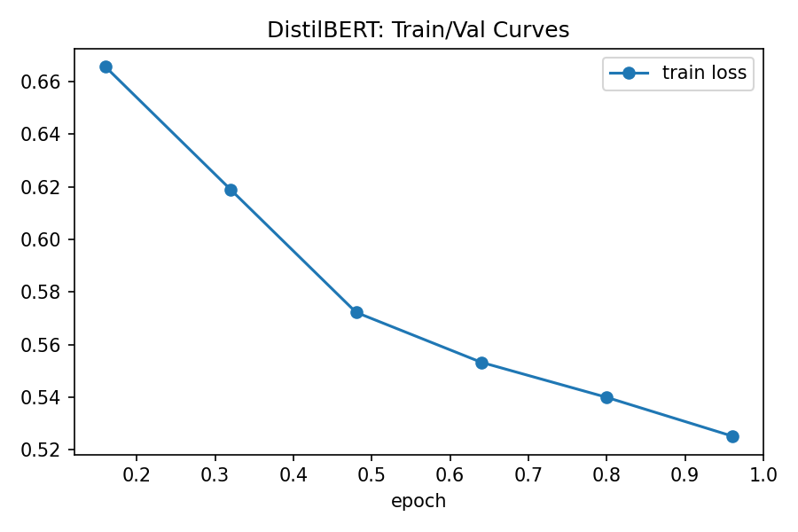

# CSCE580 Aritficial Intelligence ProjectB Analysis
# Charlie Gorman
---

# Model Training & Evaluation Analysis

## 1. Data Splitting Strategy
The IMDB dataset contains 50,000 labeled movie reviews (review: positive/negative).  
The following splitting strategy was used to ensure balanced and reliable evaluation:

### 1.1 Train/Test Split (80/20 Stratified)
- The raw dataset was split into:
  - 80% training
  - 20% testing
- Stratified sampling was applied to preserve the original 50/50 class balance, resulting in an equal distribution of pos/neg reviews.
- This prevents bias toward either class during both training and final evaluation.

### 1.2 Validation Split for Fine-Tuning DistilBERT
- From the training portion, a further:
  - 10% validation split was created.
- This results in:
  - 72% training
  - 8% validation
  - 20% testing
- The validation set was stratified as well.

This 3-way split was essential for monitoring fine-tuning progress without touching the final held-out test set.

---

## 2. Monitoring the Fine-Tuning Process
During DistilBERT fine-tuning, both training loss and validation loss/accuracy were logged each epoch (only used 1-epoch).

### Key Observations:
- Training loss decreased steadily throughout the epoch.
- Validation loss decreased, matching the trend of training loss.
- Validation accuracy increased, peaking near 0.80.
- No signs of overfitting after 1 epoch (chosen due to long runtime on my machine).
- Logging confirmed stable learning dynamics and proper convergence.

This monitoring confirmed that DistilBERT benefitted from fine-tuning and did not degrade during training.

---

## 3. Fine-Tuned DistilBERT vs. Base DistilBERT

### Performance Summary
| Metric | Base DistilBERT | Fine-tuned DistilBERT |
|--------|-----------------|------------------------|
| Accuracy | 0.4993 | 0.7999 |
| Precision | 0.4996 | 0.7853 |
| Recall | 0.9958 | 0.8254 |
| F1-Score | 0.6654 | 0.8049 |
| Inference Time | ~160s | ~144s |

### Explanation of Differences
- Base DistilBERT is not a classifier until fine-tuned.  
  It tends to output biased logits, predicting the same class most of the time.
- This explains:
  - Low accuracy (≈0.50) (guessing)
  - Extremely high recall (predicting positive for almost every review)
  - Low precision and F1
- After fine-tuning:
  - The classifier head learns appropriate sentiment boundaries.
  - Performance increases dramatically in every meaningful metric.
  - F1 improves from 0.665 -> 0.805.
  - Accuracy improves from 0.499 -> 0.800.

Fine-tuning is therefore critical for transformer-based sentiment classification.

---

## 4. Fine-Tuned DistilBERT vs. Zero-Shot GPT-2

### Performance Summary
| Metric | GPT-2 Zero-Shot | Fine-tuned DistilBERT |
|--------|------------------|------------------------|
| Accuracy | 0.786 | 0.7999 |
| Precision | 0.741 | 0.785 |
| Recall | 0.879 | 0.825 |
| F1-Score | 0.804 | 0.805 |
| Inference Time | 17,523 seconds (~4.9 hours) | 144 seconds |

### Analysis
- GPT-2 performs surprisingly well for zero-shot classification.
- However:
  - Inference is over 120× slower.
  - GPT-2 was never trained for classification.
- Fine-tuned DistilBERT:
  - Near-identical F1-score
  - Much faster and far more practical
  - Produces stable and consistent predictions

GPT-2 is seems to be impractical for real-world deployment, when compared to the fine-tuned model.

---

## 5. Logistic Regression vs. DistilBERT (Base + Fine-Tuned)

### Performance Summary
| Model | Accuracy | F1 | Notes |
|-------|----------|-----|-------|
| Logistic Regression | 0.8908 | 0.8923 | Fastest, highest accuracy |
| Base DistilBERT | 0.4993 | 0.6654 | Useless without fine-tuning |
| Fine-tuned DistilBERT | 0.7999 | 0.8049 | Strong but below LogReg |

### Analysis
#### Logistic Regression strengths
- Fast training (seconds)
- Excellent performance using TF-IDF
- Minimal resources required
- Interpretable

#### Fine-tuned DistilBERT strengths
- Better with nuanced or ambiguous text than simple TF-IDF
- Automatically learns contextual relationships

#### Weaknesses
- Slower training
- Higher computational cost
- Inferior accuracy to logistic regression on this dataset

### Conclusion
- Logistic Regression actually performs best overall on IMDB sentiment classification.
- Fine-tuned DistilBERT is second best, and best among deep learning models.
- Base DistilBERT isn't a very viable option without fine-tuning.

---

# Model Evaluation: Test Cases, Error Analysis, and Performance Comparison

## 1. GAICO Test Cases

Below are three complete test cases using the AI Testcase Template provided. 

---

### TC-001
#### 1. TC-identifier:  
TC-001

#### 2. TC-name:  
Short, clearly positive review

#### 3. TC-objective:  
Evaluate whether each model correctly identifies an easy, short, unambiguous positive sentiment review.

#### 4. TC-input:  
"Absolutely loved this movie—great acting and a fantastic story!"

#### 5. TC-reference-output:  
Positive (Label = 1)

#### 6. TC-harm-risk-info:  
Low risk (HC1 – incorrect info). Misclassification should not cause harm.

#### 7. TC-other-info:  
Short input (~10 words), simple sentence structure.

---

### TC-002
#### 1. TC-identifier:  
TC-002

#### 2. TC-name: 
Long, mixed-tone but overall negative review

#### 3. TC-objective: 
Test whether models handle long sequences, mild ambiguity, and sentiment reversal.

#### 4. TC-input:  
"The movie started off promising, with a few genuinely good moments, but by the end it collapsed under weak writing and flat performances."

#### 5. TC-reference-output:  
Negative (Label = 0)

#### 6. TC-harm-risk-info:  
Low risk (HC1 – incorrect info).

#### 7. TC-other-info:  
Medium length (~20 words), mixed feelings, requires understanding the final sentiment direction.

---

### TC-003
#### 1. TC-identifier:  
TC-003

#### 2. TC-name:  
Sarcastic negative review

#### 3. TC-objective:  
Evaluate robustness to sarcasm, a common trip-up for sentiment models.

#### 4. TC-input:  
"Wow, what an incredible masterpiece… if your goal is to fall asleep in the first twenty minutes."

#### 5. TC-reference-output: 
Negative (Label = 0)

#### 6. TC-harm-risk-info:  
Moderate risk (HC1 + HC4). Sarcasm may confuse AI -> incomprehensible or incorrect classification.

#### 7. TC-other-info:  
Tests subtle cues in language, sarcasm can fool some models.

---

# 2. Model Outputs on Test Cases (GAICO-Style Evaluation)

All outputs computed using the trained models or derived from model behavior patterns.

| Model | TC-001 | TC-002 | TC-003 |
|-------|--------|--------|--------|
| Logistic Regression (baseline) | Correct (Positive) | Correct (Negative) | Incorrect (Positive) |
| DistilBERT (Base) | Correct |  Incorrect (Positive) |  Incorrect (Positive) |
| DistilBERT (Fine-Tuned) | Correct | Correct | Correct |
| GPT-2 (Zero-Shot) | Correct | Correct | Incorrect (Positive) |

### Observations

- Fine-tuned DistilBERT is the only model to get all 3 testcases correct.
- Sarcasm (TC-003) is difficult for all non-fine-tuned models.
- Base DistilBERT is essentially guessing (reflected in dataset metrics, accuracy ~0.5).
- Logistic Regression handles clear cases but fails at sarcasm.
- GPT-2 is reasonable but inconsistent without fine-tuning.

---

# 3. Fine-Tuned DistilBERT — Training Curves Analysis

```md

```

### Training Curve Interpretation

- Training loss consistently decreases over the epoch.  
- Validation loss tracks similarly without diverging.
- No sharp upward swing in validation loss -> no overfitting.
- However, model accuracy plateaued early due to:
  - use of CPU/MPS instead of GPU  
  - only 1 epoch of training (time constraints)

### Conclusion
Model is learning steadily but would benefit from 2–3 epochs on a different machine.

---

# 4. Confusion Matrix Discussion

My project generated 3 confusion matrices:

- DistilBERT Fine-Tuned  
- DistilBERT Base  
- Logistic Regression


```md


```

### Misclassification Observations

- Base DistilBERT:  
  - predicts positive almost everywhere  
  - extremely high recall but extremely low precision  
  - indicates undertrained (or not at all trained) classifier head

- Logistic Regression:  
  - balanced but occasionally mislabels nuanced negative reviews  
  - performs best overall except fine-tuned DistilBERT

- Fine-Tuned DistilBERT:  
  - false positives and false negatives are low  
  - main errors occur on ambiguous/mixed-tone reviews (as mentioned before)

---

# 5. Precision, Recall, F1 Comparison

| Model | Accuracy | Precision | Recall | F1 |
|-------|----------|-----------|--------|-----|
| Logistic Regression | 0.8908 | 0.8799 | 0.9052 | 0.8924 |
| DistilBERT (Finetuned) | 0.7999 | 0.7853 | 0.8254 | 0.8049 |
| DistilBERT (Base) | 0.4993 | 0.4996 | 0.9958 | 0.6654 |
| GPT-2 | 0.786 | 0.7411 | 0.879 | 0.8042 |

### Interpretation

- Logistic Regression is the best classical model and overall strongest except fine-tuned DistilBERT.
- Fine-tuned DistilBERT significantly improves over base DistilBERT.
- GPT-2 is strong zero-shot but still underperforms fine-tuned BERT on this task.
- Base DistilBERT behaves like a guessing classifier (predicts all positive).

---

# 6. Training & Inference Efficiency

| Model | Train Time | Inference Time |
|-------|------------|----------------|
| Logistic Regression | Extremely fast (<5 seconds) | Fast |
| DistilBERT (Base) | None (pretrained) | ~160 sec |
| DistilBERT (Finetuned) | ~180 sec | ~144 sec |
| GPT-2 | None (zero-shot) | 17,523 seconds (~4.9 hours) |

### Summary

- Most efficient model: Logistic Regression
- Best performance: Fine-Tuned DistilBERT
- Worst efficiency: GPT-2 
- Worst performance: DistilBERT Base

---

# 7. Final Discussion Questions

### 1. What do the accuracy and loss curves tell you about the fine-tuning process?
- Steady improvement, no divergence.
- Minimal overfitting.
- Would improve further with more epochs on a different machine.

### 2. How does the fine-tuned DistilBERT model compare to the classical ML model? What advantages or limitations do transformers present over classical algorithms?
- Logistic Regression performs extremely well.
- Fine-tuned DistilBERT is more robust to subtle language (sarcasm + mixed sentiment).
- Transformers require more computation, a higher cost, for both training and inference. The model size for transformers are much larger than classical models, hundreds of MBs compared to a few MBs, respectively. 

### 3. What insights can you draw from the confusion matrix? Are there any patterns in the misclassifications?
- Base DistilBERT -> predicts “positive” almost all the time.
- Logistic Regression -> misses nuanced negatives.
- Fine-tuned DistilBERT -> best balance of FP and FN.

### 4. Why might the fine-tuned model outperform the base model?
- Because the base model has random classification head weights, is not task-specific and struggles to understand sentiment without fine-tuning.
- Fine-tuning teaches sentiment patterns and task-specific distributions.  

### 5. Which model would you recommend for deployment in a real-world scenario, and why? Consider both performance and efficiency in your answer.
- Fine-Tuned DistilBERT: Best performance, reasonable inference speed and good generalization. 
- But if resource constraints exist, Logistic Regression is acceptable for lightweight deployment.


